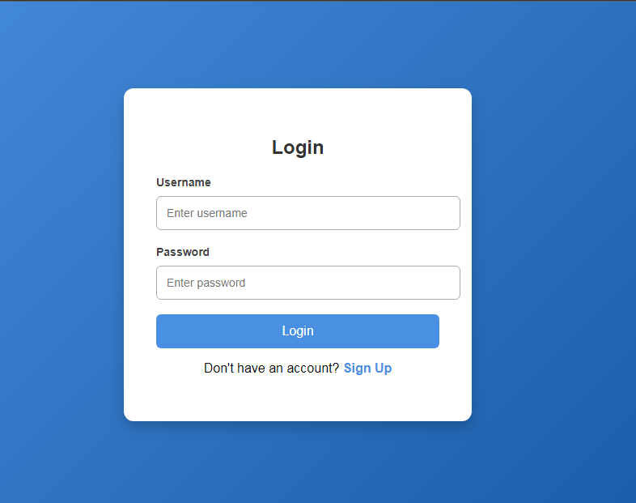

# 🌐 Login Form
This is a simple HTML/CSS project that I created while learning front-end development.
It is beginner-friendly and focuses on clean structure and simple design.

## 📸 Preview

## ✨ Features
* Clean and simple UI
* Beginner-friendly code
* Fully responsive layout
* Pure HTML and CSS only
* Easy to modify

## 🚀 Live Demo
[View the page here](https://sania-arooj.github.io/html-css-login-form/)  

## 📂 Technologies Used
* HTML5
* CSS3

## Author
**Sania Arooj**
🎓 BSCS Student.
💻 Learning Web Development.
🌱 Passionate about coding.
